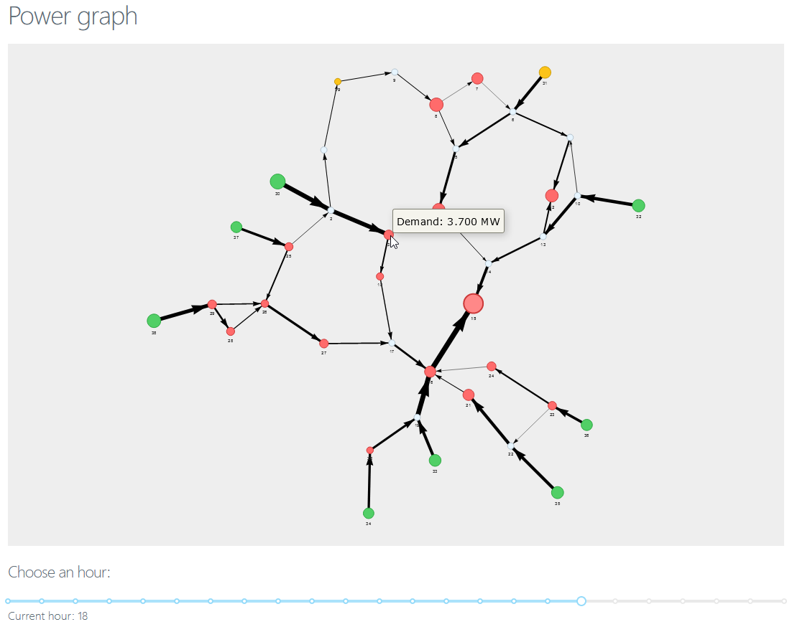

# Power Graph

## How to run

The simplest way to start the app is to start it from docker-compose by typing:

```
docker-compose up
```

After containers boot up you can access the app at http://127.0.0.1:8000/

API docs available at http://127.0.0.1:3000/docs


